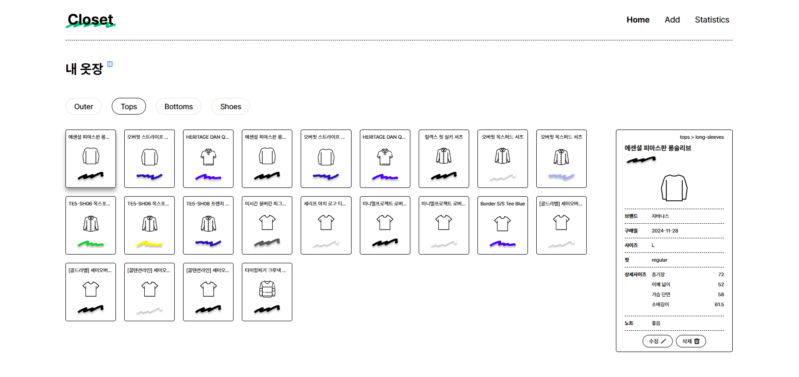
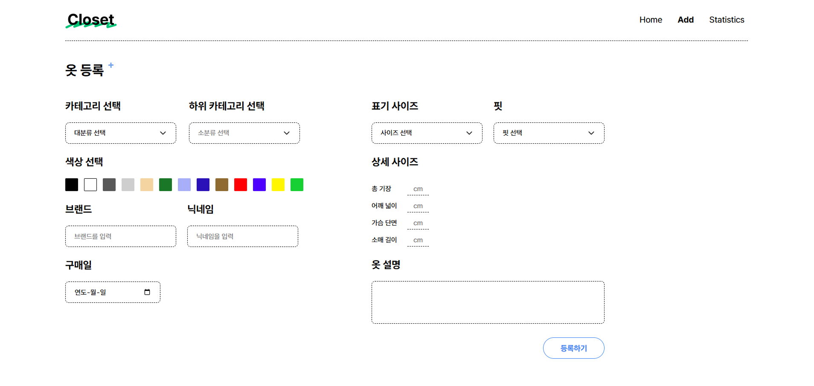
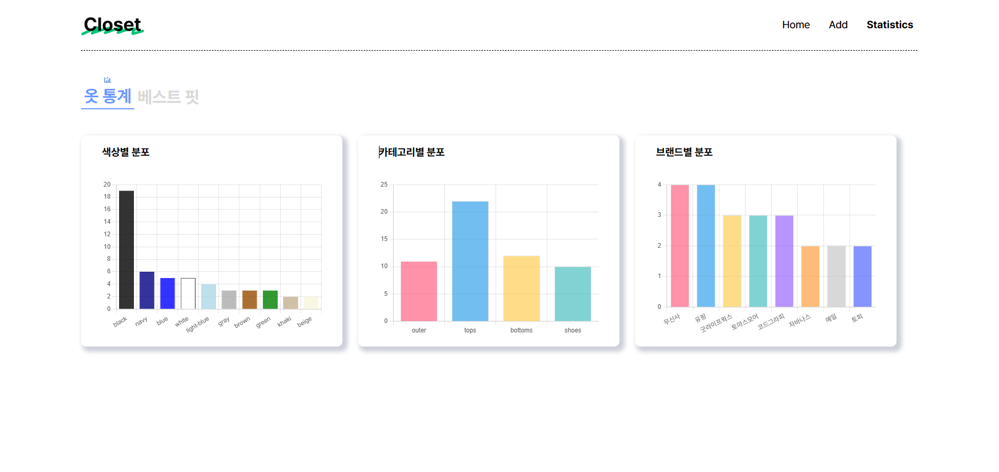
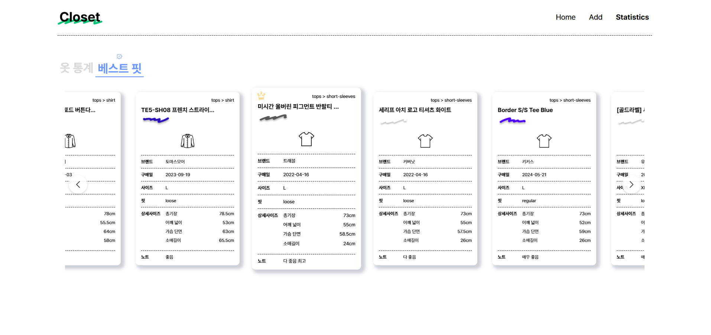

# Closet - 스마트한 옷장 관리 앱

Closet은 개인 의류 관리를 위한 웹 기반 애플리케이션입니다. 사용자가 자신의 옷장을 효율적으로 관리하고 분석할 수 있도록 도와줍니다.

## 주요 기능

- **의류 관리**: 외투, 상의, 하의, 신발 등 카테고리별 의류 관리
- **통계 분석**: 색상별, 카테고리별, 브랜드별 의류 분포 확인

## 스크린샷

### 홈


### 의류 추가


### 통계


### 베스트 핏


## 기술 스택

- HTML5
- SCSS/CSS3
- JavaScript (ES6+)

## 프로젝트 구조

```
closet/
├── index.html      # 메인 페이지
├── add.html        # 의류 추가 페이지
├── stat.html       # 통계 페이지
├── scss/           # 스타일시트
├── js/             # 자바스크립트 모듈
├── img/            # 이미지 리소스
├── data/           # 데이터 파일
└── font/           # 폰트 파일
```

## 웹 접근성 및 SEO 구현

### 웹 접근성 (Web Accessibility)
- **시맨틱 HTML**: 의미론적 마크업을 사용하여 문서 구조를 명확히 표현
- **ARIA 속성**: 
  - `aria-label`, `aria-controls`, `aria-selected` 등을 활용한 동적 콘텐츠 접근성 향상
- **이미지 대체 텍스트**: 모든 이미지에 적절한 `alt` 속성 제공
- **레이블 사용**: 모든 입력 필드에 적절한 `label` 태그 연결
- **반응형 디자인**: 미디어 쿼리를 활용한 유동적 레이아웃

### SEO 최적화
- **메타 태그**: 
  - `description`, `keywords` 등 검색 엔진 최적화를 위한 메타 태그 구현
  - Open Graph 태그를 통한 소셜 미디어 공유 최적화
- **시맨틱 구조**: 검색 엔진이 콘텐츠를 더 잘 이해할 수 있도록 의미론적 구조 적용

## 향후 개선 사항 및 회고

### 웹 접근성 개선
- **키보드 네비게이션**: 모든 상호작용 요소에 대한 키보드 접근성 완벽 구현

### 사용자 경험 개선
- **폼 유효성 검사**: 더 명확하고 직관적인 오류 메시지 표시
- **로딩 상태**: 데이터 처리 중 사용자에게 적절한 피드백 제공

### 코드 품질 개선
- **코드 이해도**: AI 도구 사용으로 인한 코드 이해도 향상 필요

### 성능 최적화
- **이미지 최적화**: 이미지 로딩 속도 개선
- **번들 크기**: JavaScript 번들 크기 최적화


